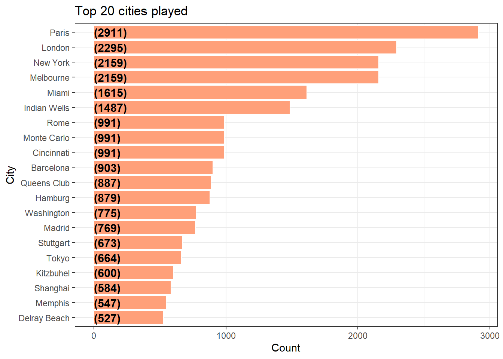
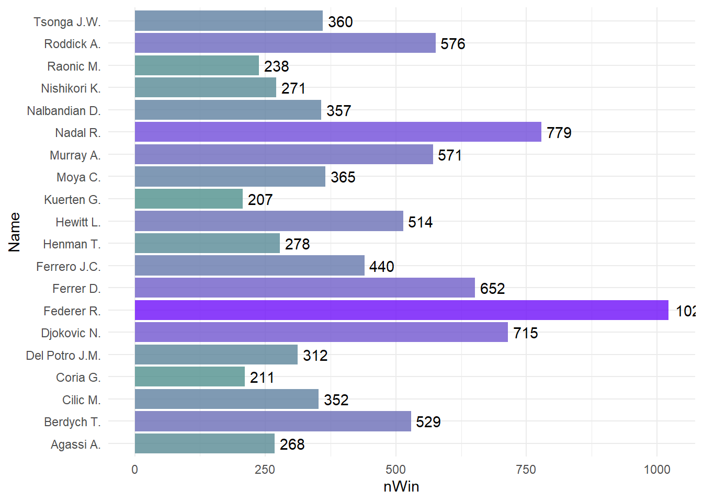
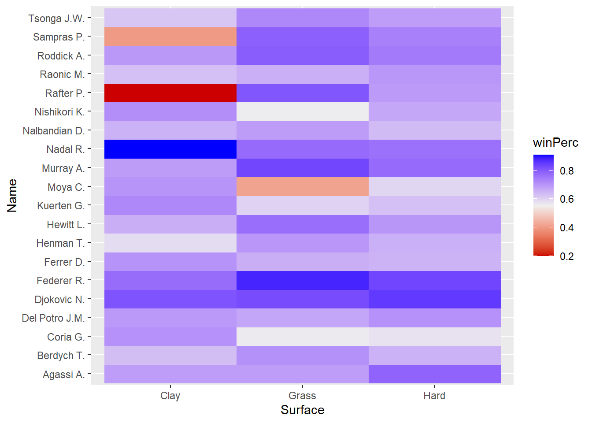

## About the data.

### Introduction.

This database contains information on tennis matches in a period from 2000 to 2016.

On this occasion, I will analyze the behavior of the players in which I will determine: The cities played, the players, the field conditions, and the years played.

In addition to that, the Igaming agencies will also be added with the predictions they had before the matches, to determine which is the best agency to go to bet.

#### Load libraries


```r
library(dplyr)
```

```
## 
## Attaching package: 'dplyr'
```

```
## The following objects are masked from 'package:stats':
## 
##     filter, lag
```

```
## The following objects are masked from 'package:base':
## 
##     intersect, setdiff, setequal, union
```

```r
library(RSQLite)
library(grid)  
library(gridExtra) 
```

```
## 
## Attaching package: 'gridExtra'
```

```
## The following object is masked from 'package:dplyr':
## 
##     combine
```

```r
library(ggExtra)
library(cowplot)
library(tidyverse)
```

```
## ── Attaching packages
## ───────────────────────────────────────
## tidyverse 1.3.2 ──
```

```
## ✔ ggplot2 3.4.0     ✔ purrr   0.3.5
## ✔ tibble  3.1.8     ✔ stringr 1.4.1
## ✔ tidyr   1.2.1     ✔ forcats 0.5.2
## ✔ readr   2.1.3     
## ── Conflicts ────────────────────────────────────────── tidyverse_conflicts() ──
## ✖ gridExtra::combine() masks dplyr::combine()
## ✖ dplyr::filter()      masks stats::filter()
## ✖ dplyr::lag()         masks stats::lag()
```

```r
library(ggvis)
```

```
## 
## Attaching package: 'ggvis'
## 
## The following object is masked from 'package:ggplot2':
## 
##     resolution
```

```r
library(shiny)
```

```
## 
## Attaching package: 'shiny'
## 
## The following object is masked from 'package:ggExtra':
## 
##     runExample
```

```r
library(DT)
```

```
## 
## Attaching package: 'DT'
## 
## The following objects are masked from 'package:shiny':
## 
##     dataTableOutput, renderDataTable
```

```r
library(stringr)
library(knitr)
library(kableExtra)
```

```
## 
## Attaching package: 'kableExtra'
## 
## The following object is masked from 'package:dplyr':
## 
##     group_rows
```

```r
library(readr)
library(reshape2)
```

```
## 
## Attaching package: 'reshape2'
## 
## The following object is masked from 'package:tidyr':
## 
##     smiths
```


```r
library(readr)
Data <- read_csv("Data.csv")
```

```
## Warning: One or more parsing issues, call `problems()` on your data frame for details,
## e.g.:
##   dat <- vroom(...)
##   problems(dat)
```

```
## Rows: 46652 Columns: 54
## ── Column specification ────────────────────────────────────────────────────────
## Delimiter: ","
## chr (12): Location, Tournament, Date, Series, Court, Surface, Round, Winner,...
## dbl (42): ATP, Best of, WRank, W1, L1, W2, L2, W3, L3, W4, L4, W5, L5, Wsets...
## 
## ℹ Use `spec()` to retrieve the full column specification for this data.
## ℹ Specify the column types or set `show_col_types = FALSE` to quiet this message.
```

```r
View(Data)
```


```r
#Converting the Rank variables into numeric variables
Data$LRank=as.numeric(Data$LRank)
```

```
## Warning: NAs introducidos por coerción
```

```r
Data$LPts=as.numeric(Data$LPts)
```

```
## Warning: NAs introducidos por coerción
```

```r
#Formatting Date to extract Season Info
Data$Date=as.Date(Data$Date,format='%d/%m/%Y')
Data$Season=as.numeric(format(Data$Date,"%Y"))

Data %>% 
  mutate(Winner = gsub(" $", "", Winner), Loser = gsub(" $", "", Loser))
```

```
## # A tibble: 46,652 × 55
##      ATP Location Tournam…¹ Date       Series Court Surface Round Best …² Winner
##    <dbl> <chr>    <chr>     <date>     <chr>  <chr> <chr>   <chr>   <dbl> <chr> 
##  1     1 Adelaide Australi… 2000-01-03 Inter… Outd… Hard    1st …       3 Dosed…
##  2     1 Adelaide Australi… 2000-01-03 Inter… Outd… Hard    1st …       3 Enqvi…
##  3     1 Adelaide Australi… 2000-01-03 Inter… Outd… Hard    1st …       3 Escud…
##  4     1 Adelaide Australi… 2000-01-03 Inter… Outd… Hard    1st …       3 Feder…
##  5     1 Adelaide Australi… 2000-01-03 Inter… Outd… Hard    1st …       3 Fromb…
##  6     1 Adelaide Australi… 2000-01-03 Inter… Outd… Hard    1st …       3 Gambi…
##  7     1 Adelaide Australi… 2000-01-03 Inter… Outd… Hard    1st …       3 Grosj…
##  8     1 Adelaide Australi… 2000-01-03 Inter… Outd… Hard    1st …       3 Henma…
##  9     1 Adelaide Australi… 2000-01-03 Inter… Outd… Hard    1st …       3 Hewit…
## 10     1 Adelaide Australi… 2000-01-03 Inter… Outd… Hard    1st …       3 Lisna…
## # … with 46,642 more rows, 45 more variables: Loser <chr>, WRank <dbl>,
## #   LRank <dbl>, W1 <dbl>, L1 <dbl>, W2 <dbl>, L2 <dbl>, W3 <dbl>, L3 <dbl>,
## #   W4 <dbl>, L4 <dbl>, W5 <dbl>, L5 <dbl>, Wsets <dbl>, Lsets <dbl>,
## #   Comment <chr>, CBW <dbl>, CBL <dbl>, GBW <dbl>, GBL <dbl>, IWW <dbl>,
## #   IWL <dbl>, SBW <dbl>, SBL <dbl>, B365W <dbl>, B365L <dbl>, `B&WW` <dbl>,
## #   `B&WL` <dbl>, EXW <dbl>, EXL <dbl>, PSW <dbl>, PSL <dbl>, WPts <dbl>,
## #   LPts <dbl>, UBW <dbl>, UBL <dbl>, LBW <dbl>, LBL <dbl>, SJW <dbl>, …
```

```r
summary(Data)
```

```
##       ATP          Location          Tournament             Date           
##  Min.   : 1.00   Length:46652       Length:46652       Min.   :2000-01-03  
##  1st Qu.:19.00   Class :character   Class :character   1st Qu.:2004-01-06  
##  Median :33.00   Mode  :character   Mode  :character   Median :2008-01-14  
##  Mean   :32.93                                         Mean   :2008-02-20  
##  3rd Qu.:49.00                                         3rd Qu.:2012-05-03  
##  Max.   :69.00                                         Max.   :2016-09-25  
##                                                                            
##     Series             Court             Surface             Round          
##  Length:46652       Length:46652       Length:46652       Length:46652      
##  Class :character   Class :character   Class :character   Class :character  
##  Mode  :character   Mode  :character   Mode  :character   Mode  :character  
##                                                                             
##                                                                             
##                                                                             
##                                                                             
##     Best of          Winner             Loser               WRank        
##  Min.   :-1.000   Length:46652       Length:46652       Min.   :   1.00  
##  1st Qu.: 3.000   Class :character   Class :character   1st Qu.:  17.00  
##  Median : 3.000   Mode  :character   Mode  :character   Median :  41.00  
##  Mean   : 3.374                                         Mean   :  59.06  
##  3rd Qu.: 3.000                                         3rd Qu.:  77.00  
##  Max.   : 5.000                                         Max.   :1890.00  
##                                                         NA's   :16       
##      LRank               W1              L1              W2       
##  Min.   :   1.00   Min.   :0.000   Min.   :0.000   Min.   :0.000  
##  1st Qu.:  35.00   1st Qu.:6.000   1st Qu.:3.000   1st Qu.:6.000  
##  Median :  66.00   Median :6.000   Median :4.000   Median :6.000  
##  Mean   :  94.08   Mean   :5.793   Mean   :4.043   Mean   :5.773  
##  3rd Qu.: 105.00   3rd Qu.:6.000   3rd Qu.:6.000   3rd Qu.:6.000  
##  Max.   :7380.00   Max.   :7.000   Max.   :7.000   Max.   :7.000  
##  NA's   :98        NA's   :229     NA's   :229     NA's   :690    
##        L2              W3              L3              W4       
##  Min.   :0.000   Min.   :0.000   Min.   :0.000   Min.   :0.00   
##  1st Qu.:2.000   1st Qu.:6.000   1st Qu.:2.000   1st Qu.:6.00   
##  Median :4.000   Median :6.000   Median :4.000   Median :6.00   
##  Mean   :3.854   Mean   :6.018   Mean   :3.593   Mean   :5.78   
##  3rd Qu.:6.000   3rd Qu.:6.000   3rd Qu.:5.000   3rd Qu.:6.00   
##  Max.   :7.000   Max.   :7.000   Max.   :7.000   Max.   :7.00   
##  NA's   :689     NA's   :25287   NA's   :25287   NA's   :42426  
##        L4              W5              L5            Wsets      
##  Min.   :0.00    Min.   : 0.00   Min.   : 0.00   Min.   :0.000  
##  1st Qu.:2.00    1st Qu.: 6.00   1st Qu.: 2.00   1st Qu.:2.000  
##  Median :4.00    Median : 6.00   Median : 4.00   Median :2.000  
##  Mean   :3.87    Mean   : 6.62   Mean   : 3.76   Mean   :2.142  
##  3rd Qu.:6.00    3rd Qu.: 7.00   3rd Qu.: 5.00   3rd Qu.:2.000  
##  Max.   :7.00    Max.   :70.00   Max.   :68.00   Max.   :3.000  
##  NA's   :42426   NA's   :45035   NA's   :45035   NA's   :190    
##      Lsets          Comment               CBW              CBL       
##  Min.   :0.0000   Length:46652       Min.   : 1.000   Min.   : 1.02  
##  1st Qu.:0.0000   Class :character   1st Qu.: 1.280   1st Qu.: 1.72  
##  Median :0.0000   Mode  :character   Median : 1.550   Median : 2.35  
##  Mean   :0.4053                      Mean   : 1.812   Mean   : 3.00  
##  3rd Qu.:1.0000                      3rd Qu.: 2.050   3rd Qu.: 3.40  
##  Max.   :2.0000                      Max.   :14.000   Max.   :25.00  
##  NA's   :190                         NA's   :29145    NA's   :29145  
##       GBW             GBL             IWW             IWL       
##  Min.   :1.01    Min.   : 1.03   Min.   :1.01    Min.   : 1.03  
##  1st Qu.:1.33    1st Qu.: 1.66   1st Qu.:1.30    1st Qu.: 1.65  
##  Median :1.55    Median : 2.10   Median :1.50    Median : 2.10  
##  Mean   :1.74    Mean   : 2.40   Mean   :1.67    Mean   : 2.39  
##  3rd Qu.:1.98    3rd Qu.: 2.80   3rd Qu.:1.85    3rd Qu.: 2.90  
##  Max.   :7.50    Max.   :11.00   Max.   :6.00    Max.   :10.00  
##  NA's   :41597   NA's   :41597   NA's   :33294   NA's   :33294  
##       SBW             SBL            B365W            B365L        
##  Min.   :0.00    Min.   : 0.00   Min.   : 1.000   Min.   :  1.002  
##  1st Qu.:1.33    1st Qu.: 1.67   1st Qu.: 1.220   1st Qu.:  1.720  
##  Median :1.57    Median : 2.25   Median : 1.500   Median :  2.500  
##  Mean   :1.79    Mean   : 2.67   Mean   : 1.817   Mean   :  3.589  
##  3rd Qu.:2.10    3rd Qu.: 3.00   3rd Qu.: 2.000   3rd Qu.:  4.000  
##  Max.   :9.00    Max.   :13.00   Max.   :29.000   Max.   :101.000  
##  NA's   :41228   NA's   :41228   NA's   :8633     NA's   :8610     
##       B&WW            B&WL            EXW              EXL       
##  Min.   :1.01    Min.   :1.02    Min.   : 0.000   Min.   : 1.01  
##  1st Qu.:1.25    1st Qu.:1.60    1st Qu.: 1.250   1st Qu.: 1.75  
##  Median :1.50    Median :2.15    Median : 1.500   Median : 2.50  
##  Mean   :1.73    Mean   :2.54    Mean   : 1.799   Mean   : 3.31  
##  3rd Qu.:1.95    3rd Qu.:3.10    3rd Qu.: 2.050   3rd Qu.: 3.80  
##  Max.   :7.50    Max.   :9.00    Max.   :20.000   Max.   :40.00  
##  NA's   :45555   NA's   :45555   NA's   :12853    NA's   :12848  
##       PSW              PSL               WPts              LPts      
##  Min.   : 1.000   Min.   :  1.010   Min.   :    1.0   Min.   :    1  
##  1st Qu.: 1.270   1st Qu.:  1.800   1st Qu.:  628.0   1st Qu.:  487  
##  Median : 1.541   Median :  2.680   Median :  994.5   Median :  724  
##  Mean   : 1.921   Mean   :  4.293   Mean   : 1836.1   Mean   : 1028  
##  3rd Qu.: 2.120   3rd Qu.:  4.300   3rd Qu.: 1860.0   3rd Qu.: 1118  
##  Max.   :46.000   Max.   :121.000   Max.   :16950.0   Max.   :16950  
##  NA's   :14923    NA's   :14923     NA's   :16204     NA's   :16256  
##       UBW             UBL             LBW              LBL        
##  Min.   : 1.01   Min.   : 1.02   Min.   : 1.000   Min.   : 1.000  
##  1st Qu.: 1.24   1st Qu.: 1.75   1st Qu.: 1.222   1st Qu.: 1.730  
##  Median : 1.50   Median : 2.50   Median : 1.500   Median : 2.620  
##  Mean   : 1.82   Mean   : 3.54   Mean   : 1.796   Mean   : 3.511  
##  3rd Qu.: 2.03   3rd Qu.: 3.85   3rd Qu.: 2.000   3rd Qu.: 4.000  
##  Max.   :18.00   Max.   :60.00   Max.   :26.000   Max.   :51.000  
##  NA's   :35980   NA's   :35980   NA's   :23422    NA's   :23413   
##       SJW              SJL              MaxW             MaxL         
##  Min.   : 1.000   Min.   : 1.010   Min.   : 1.010   Min.   :    1.01  
##  1st Qu.: 1.220   1st Qu.: 1.730   1st Qu.: 1.270   1st Qu.:    1.86  
##  Median : 1.500   Median : 2.630   Median : 1.560   Median :    2.85  
##  Mean   : 1.796   Mean   : 3.559   Mean   : 1.992   Mean   :    9.82  
##  3rd Qu.: 2.000   3rd Qu.: 4.000   3rd Qu.: 2.200   3rd Qu.:    4.74  
##  Max.   :19.000   Max.   :81.000   Max.   :76.000   Max.   :42586.00  
##  NA's   :31080    NA's   :31073    NA's   :29548    NA's   :29548     
##       AvgW            AvgL            Season    
##  Min.   : 1.01   Min.   : 1.010   Min.   :2000  
##  1st Qu.: 1.22   1st Qu.: 1.750   1st Qu.:2004  
##  Median : 1.48   Median : 2.600   Median :2008  
##  Mean   : 1.82   Mean   : 3.707   Mean   :2008  
##  3rd Qu.: 2.03   3rd Qu.: 4.090   3rd Qu.:2012  
##  Max.   :23.45   Max.   :36.440   Max.   :2016  
##  NA's   :29548   NA's   :29548
```

### Let's see the cities

Within our analysis, we can see that our favorite cities are: Paris, London, New York, and Melbourne.


```r
fillColor = "#FFA07A"
fillColor2 = "#F1C40F"

Data %>%
  group_by(Location) %>%
  summarise(Count = n()) %>%
  arrange(desc(Count)) %>%
  ungroup() %>%
  mutate(Location = reorder(Location,Count)) %>%
  head(20) %>%
  
  ggplot(aes(x = Location,y = Count)) +
  geom_bar(stat='identity',colour="white", fill = fillColor) +
  geom_text(aes(x = Location, y = 1, label = paste0("(",Count,")",sep="")),
            hjust=0, vjust=.5, size = 4, colour = 'black',
            fontface = 'bold') +
  labs(x = 'City', 
       y = 'Count', 
       title = 'Top 20 cities played') +
  coord_flip() +
  theme_bw()
```



## Let's analyse the players.

Let's take de percent of winners against losers


```r
#First lets take a look at the players:

#Winners
winners = Data %>% 
  group_by(Surface, Winner) %>% 
  summarise(nWin = n()) 
```

```
## `summarise()` has grouped output by 'Surface'. You can override using the
## `.groups` argument.
```

```r
#Losers
losers= Data %>% 
  group_by(Surface, Loser) %>% 
  summarise(nLose = n()) 
```

```
## `summarise()` has grouped output by 'Surface'. You can override using the
## `.groups` argument.
```

```r
#Format to the new tables
colnames(winners)[2] = "Name"
colnames(losers)[2] = "Name"
```


```r
players_bySurface = merge(winners, losers, by = c("Surface", "Name"), all = T) %>% 
  mutate(nWin = ifelse(is.na(nWin), 0, nWin), nLose = ifelse(is.na(nLose), 0, nLose), 
         winPerc = nWin/(nWin+nLose)) %>% 
  arrange(desc(winPerc))

#Some format of the percet of each player
players_overall = data.frame(players_bySurface %>% 
                               group_by(Name) %>% 
                               summarise(nWin = sum(nWin), nLose = sum(nLose)) %>% 
                               mutate(winPerc = paste(round(nWin/(nWin+nLose)*100,2),"%",sep="")) %>% 
                               filter(nWin+nLose>100) %>% 
                               arrange(desc(winPerc)))
```

Let's see our table, to have a better knowledge of what are we doing.

These tables are showing us the stats of all the players I am analyzing to get to know data such as Names, number of games won, number of games loosed, percentage of the total games won according to their games played.


```r
players_overall %>% 
  select(Name, nWin, nLose, winPerc) %>% 
  datatable(., options = list(pageLength = 10))
```

```{=html}
<div id="htmlwidget-cb9d6b4b047af27380bf" style="width:100%;height:auto;" class="datatables html-widget"></div>
<script type="application/json" data-for="htmlwidget-cb9d6b4b047af27380bf">{"x":{"filter":"none","vertical":false,"data":[["1","2","3","4","5","6","7","8","9","10","11","12","13","14","15","16","17","18","19","20","21","22","23","24","25","26","27","28","29","30","31","32","33","34","35","36","37","38","39","40","41","42","43","44","45","46","47","48","49","50","51","52","53","54","55","56","57","58","59","60","61","62","63","64","65","66","67","68","69","70","71","72","73","74","75","76","77","78","79","80","81","82","83","84","85","86","87","88","89","90","91","92","93","94","95","96","97","98","99","100","101","102","103","104","105","106","107","108","109","110","111","112","113","114","115","116","117","118","119","120","121","122","123","124","125","126","127","128","129","130","131","132","133","134","135","136","137","138","139","140","141","142","143","144","145","146","147","148","149","150","151","152","153","154","155","156","157","158","159","160","161","162","163","164","165","166","167","168","169","170","171","172","173","174","175","176","177","178","179","180","181","182","183","184","185","186","187","188","189","190","191","192","193","194","195","196","197","198","199","200","201","202","203","204","205","206","207","208","209","210","211","212","213","214","215","216","217","218","219","220","221","222","223","224","225","226","227","228","229","230","231","232","233","234","235","236","237","238","239","240","241","242","243","244","245","246","247","248","249","250","251","252"],["Djokovic N.","Federer R.","Nadal R.","Murray A.","Agassi A.","Roddick A.","Sampras P.","Hewitt L.","Del Potro J.M.","Rafter P.","Raonic M.","Tsonga J.W.","Kuerten G.","Ferrer D.","Nishikori K.","Nalbandian D.","Berdych T.","Henman T.","Coria G.","Moya C.","Ferrero J.C.","Cilic M.","Kafelnikov Y.","Wawrinka S.","Monfils G.","Gasquet R.","Soderling R.","Haas T.","Gonzalez F.","Safin M.","Kyrgios N.","Isner J.","Thiem D.","Rios M.","Ancic M.","Robredo T.","Canas G.","Blake J.","Bautista R.","Simon G.","Ljubicic I.","Almagro N.","Norman M.","Davydenko N.","Grosjean S.","Dimitrov G.","Novak J.","Gaudio G.","Fish M.","Corretja A.","Verdasco F.","Escude N.","Sock J.","Rusedski G.","Stepanek R.","Philippoussis M.","Anderson K.","Schalken S.","Youzhny M.","Monaco J.","El Aynaoui Y.","Kiefer N.","Querrey S.","Kohlschreiber P.","Goffin D.","Ferreira W.","Baghdatis M.","Johansson J.","Srichaphan P.","Johansson T.","Enqvist T.","Martin T.","Chela J.I.","Karlovic I.","Golmard J.","Costa A.","Troicki V.","Lopez F.","Calleri A.","Puerta M.","Cuevas P.","Dent T.","Melzer J.","Dolgopolov O.","Tipsarevic J.","Nieminen J.","Hrbaty D.","Mantilla F.","Malisse X.","Tomic B.","Tursunov D.","Santoro F.","Gambill J.M.","Pioline C.","Johnson S.","Pavel A.","Andreev I.","Massu N.","Arazi H.","Acasuso J.","Mirnyi M.","Clement A.","Kucera K.","Mayer F.","Gulbis E.","Schuettler R.","Bjorkman J.","Squillari F.","Fognini F.","Muller G.","Lapentti N.","Chardy J.","Coric B.","Mathieu P.H.","Zabaleta M.","Ginepri R.","Janowicz J.","Klizan M.","Seppi A.","Delbonis F.","Benneteau J.","Bellucci T.","Vinciguerra A.","Paire B.","Garcia-Lopez G.","Chang M.","Montanes A.","Saretta F.","Dodig I.","Sousa J.","Granollers M.","Verkerk M.","Rochus O.","Mayer L.","Petzschner P.","Ramos A.","Llodra M.","Spadea V.","Istomin D.","Kuznetsov An.","Horna L.","Meligeni F.","Hanescu V.","Martin A.","Gicquel M.","Mahut N.","Ulihrach B.","Voltchkov V.","Haase R.","Lee H.T.","Koubek S.","Vesely J.","Ramos-Vinolas A.","Rosset M.","Darcis S.","Giraldo S.","Kratochvil M.","Carlsen K.","Volandri F.","Starace P.","Goldstein P.","Stakhovsky S.","Pospisil V.","Arthurs W.","Clavet F.","Rosol L.","Boutter J.","Berankis R.","Korolev E.","Ivanisevic G.","Mannarino A.","Moodie W.","Sluiter R.","Gil F.","Sanchez D.","Lajovic D.","Sargsian S.","Vliegen K.","Berlocq C.","Bedene A.","Devvarman S.","Becker B.","Serra F.","Calatrava A.","Sela D.","Harrison R.","Hernych J.","Bolelli S.","Brown D.","Andujar P.","De Bakker T.","Marchenko I.","Popp A.","Sanguinetti D.","Kubot L.","Kukushkin M.","Lu Y.H.","Portas A.","Bogomolov A.","Roger-Vasselin E.","Vicente F.","Saulnier C.","Matosevic M.","Dupuis A.","Voinea A.","Ilie A.","Blanco G.","Brands D.","Young D.","Carreno-Busta P.","Berrer M.","Zverev M.","Falla A.","Zeballos H.","Kamke T.","Dancevic F.","Vassallo-Arguello M.","Ram R.","Mello R.","Greul S.","Lacko L.","Gimelstob J.","Kunitsyn I.","Phau B.","Gaudenzi A.","Gimeno-Traver D.","Gabashvili T.","Sa A.","Lorenzi P.","Vanek J.","Behrend T.","Chiudinelli M.","Burgsmuller L.","Sijsling I.","Beck K.","Rochus C.","Kavcic B.","Bastl G.","Labadze I.","Pless K.","Cipolla F.","Russell M.","Capdeville P.","Hernandez O.","Ramirez-Hidalgo R.","Levy H.","Golubev A.","Kim K.","Ebden M.","Kendrick R.","Luczak P.","Zib T."],[715,1022,779,571,268,576,98,514,312,72,238,360,207,652,271,357,529,278,211,365,440,352,187,415,370,438,285,423,328,343,67,299,119,100,192,514,221,343,134,387,387,372,109,469,269,191,214,245,291,139,446,108,100,158,359,126,227,170,459,322,156,223,272,360,115,117,287,67,207,205,137,76,303,313,76,145,227,413,196,84,134,147,325,184,229,361,235,124,266,141,222,222,140,59,89,184,218,218,111,181,202,254,86,213,197,272,179,97,218,153,181,201,51,269,146,185,74,91,288,72,248,161,73,119,272,67,256,67,112,96,182,55,220,116,87,68,182,169,163,53,113,56,186,187,92,155,86,47,139,119,160,55,47,61,72,136,70,84,167,146,72,133,75,105,64,104,60,56,70,47,100,47,84,49,86,49,92,83,114,49,48,152,122,56,102,70,80,103,49,117,54,45,44,114,81,83,132,89,63,84,100,73,62,77,46,41,58,56,95,42,87,73,95,57,58,52,47,54,51,43,61,56,85,77,39,95,109,44,62,66,39,44,63,47,60,113,38,40,41,42,35,77,35,65,62,39,51,44,36,35,35,37],[141,219,171,174,85,197,40,213,133,31,112,170,101,320,134,184,278,147,113,200,243,195,104,233,211,251,166,247,192,201,40,181,74,63,122,331,144,229,90,261,263,256,75,325,187,133,150,173,209,101,324,79,74,118,273,96,173,131,359,252,123,177,216,286,92,94,231,54,172,171,115,64,262,271,66,127,199,366,179,77,123,135,299,170,213,336,219,116,250,133,210,211,134,57,87,180,214,214,109,178,201,254,86,214,198,276,182,99,224,158,187,208,53,280,152,194,78,97,307,77,266,173,80,131,300,74,286,75,127,109,207,63,254,136,102,80,215,200,195,64,137,68,226,228,113,191,106,58,172,148,200,69,59,77,91,172,89,107,215,188,93,172,97,136,83,135,78,73,92,62,132,63,113,66,116,67,126,114,158,68,67,213,171,79,144,99,114,147,70,168,78,65,64,167,119,122,194,131,93,124,148,109,93,116,70,63,90,87,148,66,142,120,157,95,97,87,79,91,86,73,104,96,146,134,68,166,192,78,110,118,70,80,115,86,110,208,70,74,77,79,66,147,67,125,123,80,107,93,77,77,80,89],["83.53%","82.35%","82%","76.64%","75.92%","74.51%","71.01%","70.7%","70.11%","69.9%","68%","67.92%","67.21%","67.08%","66.91%","65.99%","65.55%","65.41%","65.12%","64.6%","64.42%","64.35%","64.26%","64.04%","63.68%","63.57%","63.19%","63.13%","63.08%","63.05%","62.62%","62.29%","61.66%","61.35%","61.15%","60.83%","60.55%","59.97%","59.82%","59.72%","59.54%","59.24%","59.24%","59.07%","58.99%","58.95%","58.79%","58.61%","58.2%","57.92%","57.92%","57.75%","57.47%","57.25%","56.8%","56.76%","56.75%","56.48%","56.11%","56.1%","55.91%","55.75%","55.74%","55.73%","55.56%","55.45%","55.41%","55.37%","54.62%","54.52%","54.37%","54.29%","53.63%","53.6%","53.52%","53.31%","53.29%","53.02%","52.27%","52.17%","52.14%","52.13%","52.08%","51.98%","51.81%","51.79%","51.76%","51.67%","51.55%","51.46%","51.39%","51.27%","51.09%","50.86%","50.57%","50.55%","50.46%","50.46%","50.45%","50.42%","50.12%","50%","50%","49.88%","49.87%","49.64%","49.58%","49.49%","49.32%","49.2%","49.18%","49.14%","49.04%","49%","48.99%","48.81%","48.68%","48.4%","48.4%","48.32%","48.25%","48.2%","47.71%","47.6%","47.55%","47.52%","47.23%","47.18%","46.86%","46.83%","46.79%","46.61%","46.41%","46.03%","46.03%","45.95%","45.84%","45.8%","45.53%","45.3%","45.2%","45.16%","45.15%","45.06%","44.88%","44.8%","44.79%","44.76%","44.69%","44.57%","44.44%","44.35%","44.34%","44.2%","44.17%","44.16%","44.03%","43.98%","43.72%","43.71%","43.64%","43.61%","43.6%","43.57%","43.54%","43.51%","43.48%","43.41%","43.21%","43.12%","43.1%","42.73%","42.64%","42.61%","42.57%","42.24%","42.2%","42.13%","41.91%","41.88%","41.74%","41.64%","41.64%","41.48%","41.46%","41.42%","41.24%","41.2%","41.18%","41.05%","40.91%","40.91%","40.74%","40.57%","40.5%","40.49%","40.49%","40.45%","40.38%","40.38%","40.32%","40.11%","40%","39.9%","39.66%","39.42%","39.19%","39.16%","39.09%","38.89%","37.99%","37.82%","37.7%","37.5%","37.42%","37.41%","37.3%","37.24%","37.23%","37.07%","36.97%","36.84%","36.8%","36.49%","36.45%","36.4%","36.21%","36.07%","36.05%","35.87%","35.78%","35.48%","35.39%","35.34%","35.29%","35.2%","35.19%","35.09%","34.75%","34.71%","34.65%","34.38%","34.31%","34.21%","33.51%","32.77%","32.28%","32.12%","31.86%","31.25%","30.43%","29.37%"]],"container":"<table class=\"display\">\n  <thead>\n    <tr>\n      <th> <\/th>\n      <th>Name<\/th>\n      <th>nWin<\/th>\n      <th>nLose<\/th>\n      <th>winPerc<\/th>\n    <\/tr>\n  <\/thead>\n<\/table>","options":{"pageLength":10,"columnDefs":[{"className":"dt-right","targets":[2,3]},{"orderable":false,"targets":0}],"order":[],"autoWidth":false,"orderClasses":false}},"evals":[],"jsHooks":[]}</script>
```

Now I want to short this list for those players who played 100 games.


```r
df100<- players_overall %>% 
  filter(nWin > 100) %>% 
  arrange(desc(nWin)) %>% 
  as.data.frame()
```

Now let's see the top 20 of the players


```r
top20 <- df100 %>% 
    arrange(desc(winPerc)) %>% 
    head(n = 20) %>%
    as.data.frame()

top20 %>% 
  select(Name, nWin, nLose, winPerc) %>% 
  datatable(., options = list(pageLength = 10))
```

```{=html}
<div id="htmlwidget-e62eb571b51525cab88f" style="width:100%;height:auto;" class="datatables html-widget"></div>
<script type="application/json" data-for="htmlwidget-e62eb571b51525cab88f">{"x":{"filter":"none","vertical":false,"data":[["1","2","3","4","5","6","7","8","9","10","11","12","13","14","15","16","17","18","19","20"],["Djokovic N.","Federer R.","Nadal R.","Murray A.","Agassi A.","Roddick A.","Hewitt L.","Del Potro J.M.","Raonic M.","Tsonga J.W.","Kuerten G.","Ferrer D.","Nishikori K.","Nalbandian D.","Berdych T.","Henman T.","Coria G.","Moya C.","Ferrero J.C.","Cilic M."],[715,1022,779,571,268,576,514,312,238,360,207,652,271,357,529,278,211,365,440,352],[141,219,171,174,85,197,213,133,112,170,101,320,134,184,278,147,113,200,243,195],["83.53%","82.35%","82%","76.64%","75.92%","74.51%","70.7%","70.11%","68%","67.92%","67.21%","67.08%","66.91%","65.99%","65.55%","65.41%","65.12%","64.6%","64.42%","64.35%"]],"container":"<table class=\"display\">\n  <thead>\n    <tr>\n      <th> <\/th>\n      <th>Name<\/th>\n      <th>nWin<\/th>\n      <th>nLose<\/th>\n      <th>winPerc<\/th>\n    <\/tr>\n  <\/thead>\n<\/table>","options":{"pageLength":10,"columnDefs":[{"className":"dt-right","targets":[2,3]},{"orderable":false,"targets":0}],"order":[],"autoWidth":false,"orderClasses":false}},"evals":[],"jsHooks":[]}</script>
```

#### About our top 20

According to our data, Federer is the player who won the most matches from 2000 through 2016 for a significant advantage. Followed by Nadal and Djokovic.

The next places at the top of the players behave with a constant gap because unlike Federer who has a bigger advantage, the next players in the table tend to have a smaller trend.


```r
top20 %>% 
  ggplot(aes(y = Name , x = nWin , fill = nWin )) +
  geom_bar(stat="identity",position=position_dodge(), alpha = 0.8) + theme_minimal() + 
  scale_fill_gradient(low="#4f908c",high="#6e0ff9") +  theme(legend.position="none")+
  geom_text(aes(label= nWin), hjust= -0.2)
```



#### About the surface.

Now let's see if the type of field affects the performance of the players, to have an understanding of the field circumstances.

According to the heat map, Federer and Nadal have similar competition on the "Grass" and "Clays" fields, finding significant competitiveness between both players.

However, the circumstance of the surface is not something that determines whether or not the player will win the game.


```r
ggplot(data.frame(players_bySurface %>% 
                    filter (Name %in% players_overall[1:20, "Name"] & Surface != "Carpet")), aes(x = Surface, y = Name)) +
  geom_raster(aes(fill = winPerc))+
  labs(x = "Surface", y = "Name")+
  scale_fill_gradientn(colours=c("#cc0000","#eeeeee","#0000ff"))
```



## About the odds agencies.

Now we will talk about the Igaming agencies and how they have behaved over time, to know which one is best for me to invest and bet on.

I'm sure Federer will win me a couple of bucks! But let's see which agency tends to have a better prediction of games won and lost.

First, let me create a dataframe for this analysis.


